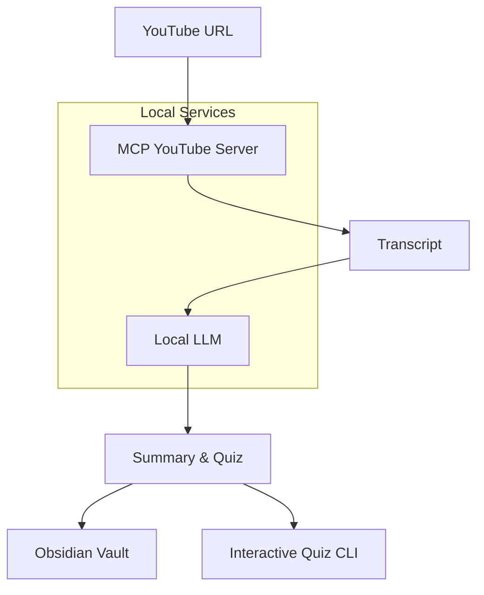

# YouTube Learning Pipeline

> Transform YouTube videos into Obsidian notes with interactive quizzes using local LLMs

[](https://github.com/abaddon-moriarty/the_pere_spicace/actions/workflows/python-tests.yml)
[](https://github.com/abaddon-moriarty/the_pere_spicace/actions/workflows/docker-build.yml)
[](https://github.com/abaddon-moriarty/the_pere_spicace/actions/workflows/codeql-analysis.yml)
[](LICENSE)
[](https://www.python.org/downloads/)
[](https://github.com/astral-sh/ruff)

## Overview

**YouTube Learning Pipeline** is a self-hosted tool that automates learning from YouTube videos. It downloads videos, extracts transcripts, generates structured summaries in Obsidian, and creates interactive quizzes to test your retention—all running locally on your machine with privacy in mind.

### Features

- **Privacy-First**: Everything runs locally—no data sent to external APIs
- **Smart Summarization**: Uses local LLMs (Ollama/LM Studio) to create concise summaries
- **Obsidian Integration**: Automatically creates well-formatted notes in your vault
- **Interactive Quizzes**: Generates questions to test your understanding
- **Docker Support**: Containerized for easy deployment
- **MCP Integration**: Uses Model Context Protocol for extensible tool integration
- **Test Suite**: Comprehensive tests for reliable operation

## Quick Start

### Prerequisites

- **Python 3.9+** and **pip**
- **Docker Desktop** (optional, for containerized deployment)
- **Obsidian** (for note-taking)
- **Local LLM**: Either [Ollama](https://ollama.ai/) or [LM Studio](https://lmstudio.ai/)

### Installation

```bash
# Clone the repository
git clone https://github.com/abaddon-moriarty/the_pere_spicace.git
cd the_pere_spicace

# Create virtual environment
python -m venv venv
source venv/bin/activate  # On Windows: venv\Scripts\activate

# Install dependencies
pip install -e ".[dev]"

# Set up environment variables
cp .env

### Basic Usage

```bash
# Process a YouTube video
python main.py --url "https://www.youtube.com/watch?v=EXAMPLE"

# Or use the interactive mode
python main.py
# Then enter the URL when prompted
```

## Architecture



### Core Components
1. **MCP Client**: Connects to YouTube transcript server
2. **LLM Integration**: Summarizes content using Ollama or LM Studio
3. **Obsidian Writer**: Creates structured markdown notes
4. **Quiz Generator**: Produces retention-testing questions
5. **CLI Interface**: User-friendly command-line interaction

## Project Structure

```
youtube-learning-pipeline/
├── src/
│   ├── mcp/                    # MCP client implementation
│   ├── llm/                    # LLM integration (Ollama/LM Studio)
│   ├── obsidian/              # Obsidian vault operations
│   ├── processing/            # Summary and quiz generation
│   ├── cli/                   # Command-line interface
│   └── utils/                 # Shared utilities
├── tests/                     # Test suite
├── docker/                    # Docker configuration
├── scripts/                   # Utility scripts
├── .github/workflows/        # CI/CD pipelines
└── config/                   # Configuration files
```

## Configuration

### Environment Variables

Create a `.env` file:

```env
# LLM Configuration
LLM_TYPE=ollama                 # ollama or lmstudio
OLLAMA_MODEL=llama3.2          # Model name for Ollama
LMSTUDIO_ENDPOINT=http://localhost:1234/v1

# Obsidian Configuration
OBSIDIAN_VAULT_PATH=/path/to/your/vault
OBSIDIAN_TEMPLATE_PATH=./config/templates/note_template.md

# MCP Configuration
MCP_SERVER_TYPE=docker

# Application Settings
TEMP_DIR=./temp
LOG_LEVEL=INFO
```

### LLM Setup

#### Option 1: Ollama
```bash
# Install Ollama
curl -fsSL https://ollama.ai/install.sh | sh

# Pull a model
ollama pull llama3.2
```

#### Option 2: LM Studio
1. Download and install [LM Studio](https://lmstudio.ai/)
2. Download a model (e.g., Mistral, Llama 2)
3. Start the local server (default: http://localhost:1234)

## Docker Deployment

### Build the Image
```bash
docker build -f docker/Dockerfile -t youtube-pipeline .
```

### Run with Docker
```bash
# Basic usage
docker run -it --rm \
  -v /path/to/obsidian/vault:/app/obsidian_vault \
  youtube-pipeline --url "YOUTUBE_URL"

# With environment file
docker run -it --rm \
  --env-file .env \
  -v $(pwd)/obsidian_vault:/app/obsidian_vault \
  youtube-pipeline
```

### Docker Compose
```bash
docker-compose -f docker/docker-compose.yml up
```

## Testing

```bash
# Install test dependencies
pip install -e ".[dev]"

# Run all tests
pytest

# Run specific test modules
pytest tests/unit/test_main.py -v
pytest tests/unit/mcp/ -v

# Run with coverage
pytest --cov=src --cov-report=html

# Run the test runner script
python scripts/run_tests.py --type unit --coverage --verbose
```

## Development

### Setting Up Development Environment
```bash
# Install development dependencies
pip install -e ".[dev]"

# Set up pre-commit hooks
pre-commit install

# Run tests on change
pytest-watch  # Optional: pip install pytest-watch
```

### Code Style
- **Formatter**: Ruff (replaces Black)
- **Linter**: Ruff (replaces Flake8)
- **Import Sorter**: Ruff (replaces isort)
- **Type Checking**: mypy

### Branch Strategy
- `main`: Production-ready code
- `develop`: Integration branch
- `feature/*`: New features
- `fix/*`: Bug fixes

### Commit Convention
We follow [Conventional Commits](https://www.conventionalcommits.org/):
- `feat:` New feature
- `fix:` Bug fix
- `docs:` Documentation
- `style:` Formatting
- `refactor:` Code restructuring
- `test:` Test updates
- `chore:` Maintenance

## 📊Roadmap

### Phase 1 (Current) 
- [x] YouTube transcript extraction via MCP
- [x] Basic LLM integration
- [x] Obsidian note creation
- [x] CLI interface

### Phase 2 (In Progress) 
- [ ] Advanced quiz generation
- [ ] Multiple question types
- [ ] Progress tracking
- [ ] Batch processing

### Phase 3 (Planned) 
- [ ] Web interface
- [ ] Mobile app
- [ ] Plugin system
- [ ] Community templates

## Contributing

We welcome contributions! Please see our [Contributing Guide](CONTRIBUTING.md) for details.

1. **Fork the repository**
2. **Create a feature branch**: `git checkout -b feature/amazing-feature`
3. **Commit your changes**: `git commit -m 'feat: add amazing feature'`
4. **Push to the branch**: `git push origin feature/amazing-feature`
5. **Open a Pull Request**

### Development Setup
```bash
# Fork and clone
git clone https://github.com/abaddon-moriarty/the_pere_spicace.git

# Set up upstream remote
git remote add upstream https://github.com/originalowner/youtube-learning-pipeline.git

# Create virtual environment and install dependencies
make setup
```

## Troubleshooting

### Common Issues

#### "Unable to connect to MCP server"
- Ensure the MCP server is running: `uvx mcp-youtube-transcript --help`
- Check Docker is running if using Docker mode

#### "LLM not responding"
- Verify Ollama/LM Studio is running
- Check model is downloaded: `ollama list`
- Confirm API endpoint is correct

#### "Obsidian vault not found"
- Verify the path in `.env` is correct
- Check write permissions to the vault directory

### Debug Mode
```bash
# Enable verbose logging
LOG_LEVEL=DEBUG python main.py --url "YOUTUBE_URL"

# Or in Docker
docker run -e LOG_LEVEL=DEBUG youtube-pipeline --url "YOUTUBE_URL"
```

## 📄 License

This project is licensed under the MIT License - see the [LICENSE](LICENSE) file for details.

## ⭐ Support

If you find this project useful, please give it a star on GitHub!

---

<div align="center">
  <sub>Built with ❤️ and ☕ by the open-source community</sub>
</div>